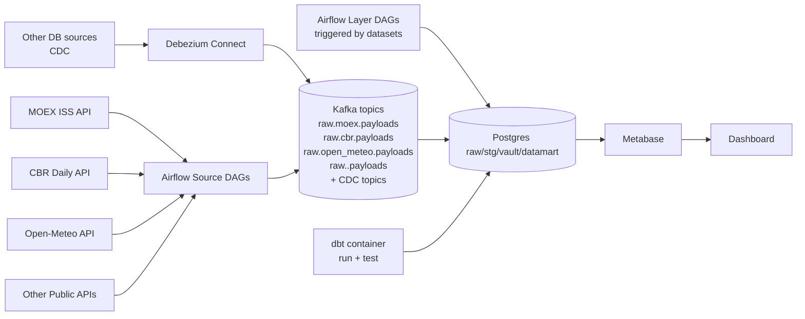
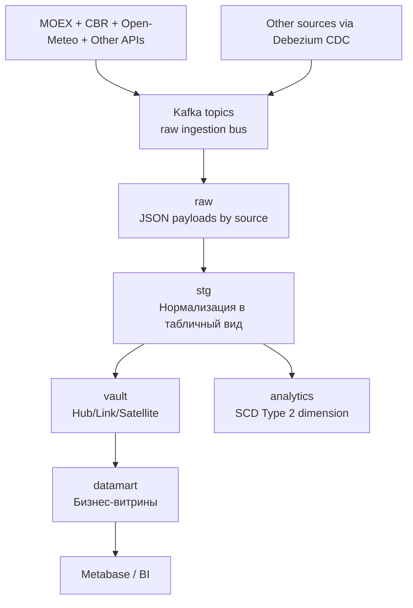
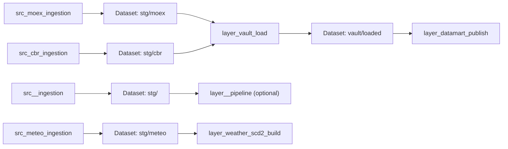

# Архитектура ETL-воркшопа

Выбранная методология моделирования: **Data Vault 2.0**.

## 1) Диаграмма всего проекта (инструменты и взаимодействие)

## 2) Поток данных по слоям

## 3) Оркестрация

