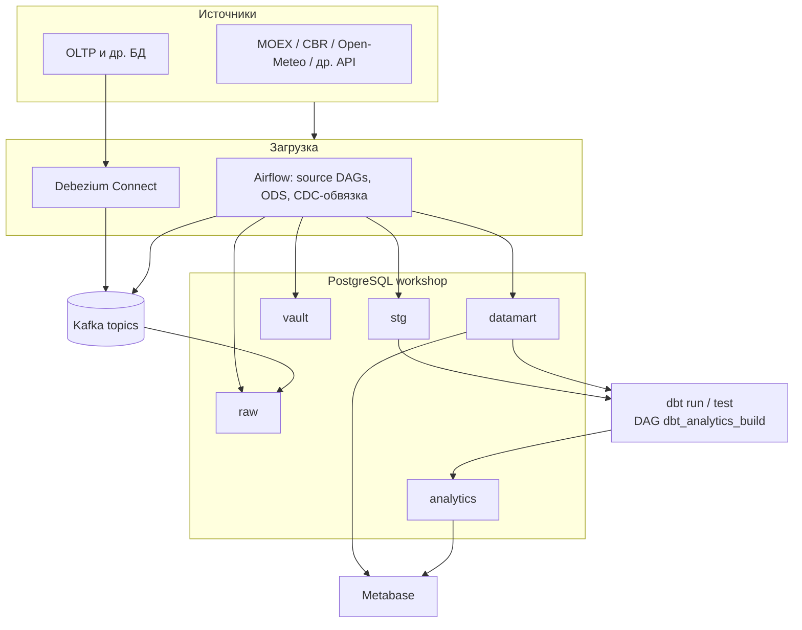
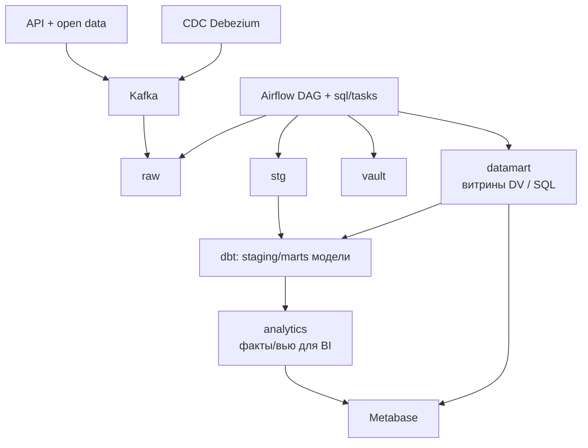
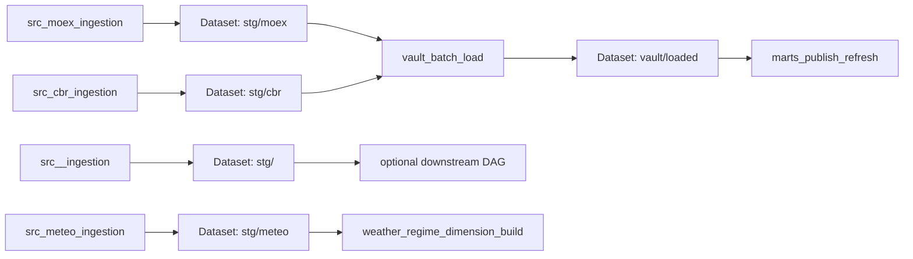

# Архитектура ETL-воркшопа

Выбранная методология моделирования: **Data Vault 2.0**.

**Интерактивная карта контейнеров и портов** (откройте файл в браузере): [`services-map.html`](services-map.html) — узлы перетаскиваются, по клику — ссылки на UI и подсказки по профилям `bi` / `dbt`.

## 1) Диаграмма всего проекта (инструменты и взаимодействие)

**Смысл:** **Airflow** оркестрирует загрузку и вызывает **plain SQL** (`sql/tasks`) для слоёв до **`datamart`**. **dbt** — отдельный шаг: читает уже лежащие в Postgres **`stg`/`datamart`**, пишет в **`analytics`**. **Metabase** смотрит на **`datamart`** и **`analytics`**.

Пояснение к стрелкам **Airflow → слои Postgres:** на схеме показано кратко; фактически большая часть шагов **`raw` → `stg` → `vault` → `datamart`** выполняется SQL-файлами из **`sql/tasks`**, вызываемыми из DAG (см. также раздел «Оркестрация» ниже).

## 2) Поток данных по слоям (где plain SQL, где dbt)

| Слой в Postgres | Как появляется |
|-----------------|----------------|
| `raw` … `datamart` | **Airflow** + **`sql/tasks`** (и bootstrap), без dbt |
| `analytics` | **dbt** (`dbt run`), после готовности витрин в `datamart` |

## 3) Оркестрация

После публикации витрин (Dataset **`datamart/published`**) в ход идёт DAG **`dbt_analytics_build`**: **`dbt run`** / **`dbt test`** → схема **`analytics`**.

Отдельно по расписанию: DAG `ods_*` публикуют ответы публичных REST в Kafka (`raw.ods.*`) и consumer пишет в `raw.ods_economic_payloads`, `raw.ods_territory_payloads` и при необходимости `raw.ods_public_api_payloads` (см. `config/open_data_sources.example.yaml`).
