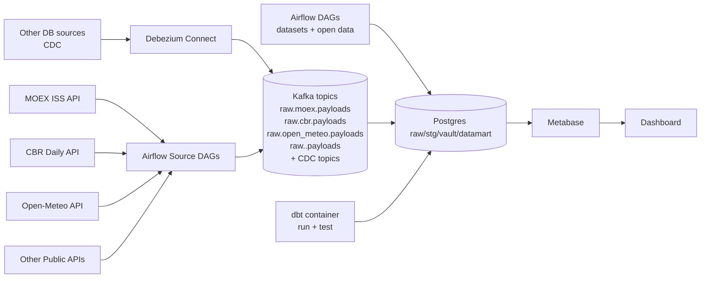
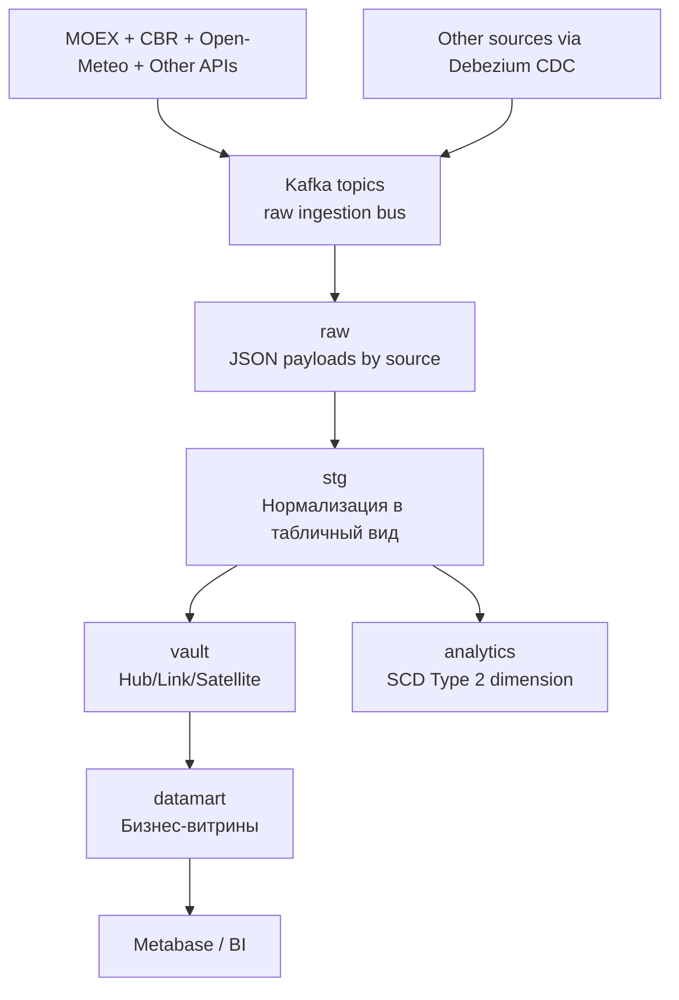
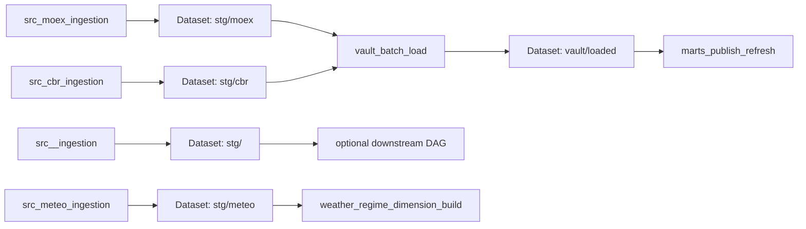

# Архитектура ETL-воркшопа

Выбранная методология моделирования: **Data Vault 2.0**.

**Интерактивная карта контейнеров и портов** (откройте файл в браузере): [`services-map.html`](services-map.html) — узлы перетаскиваются, по клику — ссылки на UI и подсказки по профилям `bi` / `dbt`.

## 1) Диаграмма всего проекта (инструменты и взаимодействие)

## 2) Поток данных по слоям

## 3) Оркестрация

Отдельно по расписанию: DAG `ods_*` публикуют ответы публичных REST в Kafka (`raw.ods.*`) и consumer пишет в `raw.ods_economic_payloads` / `raw.ods_territory_payloads` (см. `config/open_data_sources.example.yaml`).
