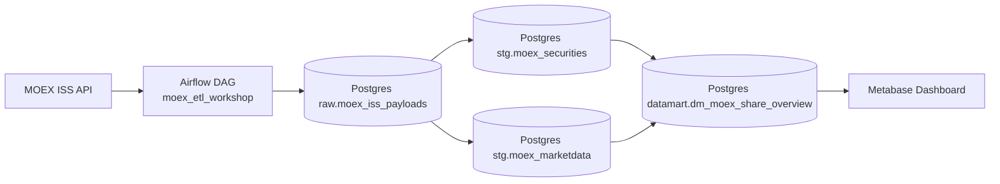
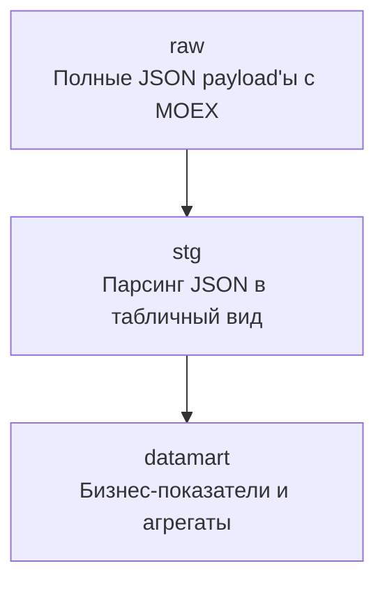
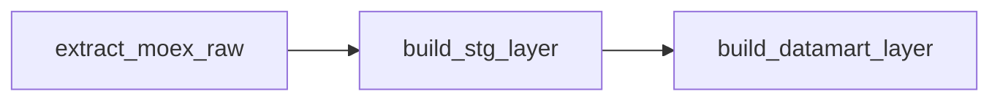

# Архитектура ETL-воркшопа

## 1) Поток данных

```mermaid
flowchart LR
    A[MOEX ISS API] --> B[Airflow DAG<br/>moex_etl_workshop]
    B --> C[(Postgres raw.moex_iss_payloads)]
    C --> D[(Postgres stg.moex_securities)]
    C --> E[(Postgres stg.moex_marketdata)]
    D --> F[(Postgres datamart.dm_moex_share_overview)]
    E --> F
    F --> G[Metabase Dashboard]
```

## 2) Слои хранилища

```mermaid
flowchart TB
    RAW["raw<br/>Полные JSON payload'ы с MOEX"] --> STG["stg<br/>Парсинг JSON в табличный вид"]
    STG --> DM["datamart<br/>Бизнес-показатели и агрегаты"]
```

## 3) Оркестрация в Airflow

```mermaid
flowchart LR
    T1["extract_moex_raw"] --> T2["build_stg_layer"]
    T2 --> T3["build_datamart_layer"]
```
