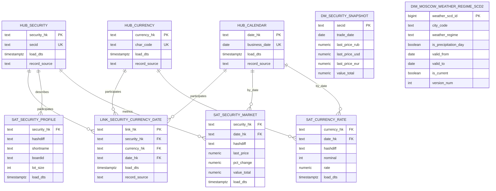

# Data Model (Data Vault 2.0)

## Концептуальная схема

## Ключевая идея методологии

- **Hub** хранит бизнес-ключи (`SECID`, `CHAR_CODE`, `DATE`).
- **Link** фиксирует связи между ключами.
- **Satellite** хранит изменяемые атрибуты и метрики.
- **Datamart** строится поверх Vault для BI и аналитики.
- **SCD Type 2** в `analytics.dim_moscow_weather_regime_scd2` хранит историю режимов погоды по окнам валидности.

## Организация по источникам

Vault SQL разложен по source-папкам для прозрачности:

- `sql/pipelines/DV-210_vault_load/moex/hubs|links|satellites`
- `sql/pipelines/DV-210_vault_load/cbr/hubs|links|satellites`
- `sql/pipelines/DV-210_vault_load/meteo/hubs|links|satellites`

Для нового источника добавляется отдельная папка по тому же шаблону:

- `sql/pipelines/DV-210_vault_load/<new_source>/hubs|links|satellites`
